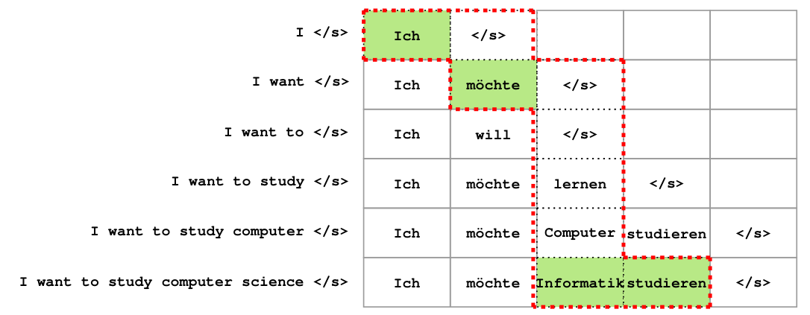

# Translation-based Supervision for Policy Generation in Simultaneous Neural Machine Translation




# Table of contents
1. [Installation](#installation)
2. [Getting Started](#Getting-Started)
3. [Citation](#citation)

# Installation
You may need to run `pip install --editable .` first.

# Getting Started
Here is the simplest way to train agent on IWSLT14 dataset for DE -> EN language direction:

## Generating oracle action sequences

```
python fairseq_cli/generate_input.py 
/path/to/datafolder/data-bin/wmt14_en_de/  
-s de 
-t en 
--user-dir ../examples/Supervised_simul_MT 
--task Supervised_simultaneous_translation 
--gen-subset test 
--path ./multipath_iwslt14_de_en/checkpoint_best.pt 
--left-pad-source False 
--max-tokens 10000 
--skip-invalid-size-inputs-valid-test 
--beam 5 
--has-target False 
--eval-waitk 5 > ./path/to/outputfolder/test.beam5_notarget.input.txt
```

p.s. By adding `--distort-action-sequence` to above command you can generate distorted samples.


By changing the value for --gen-subset to train, test, and valid you can generate oracle action sequences for the samples in each subset. Then by running `run_generate_input.sh` you can split them into three source, target, and action files (make sure `mt_path` is pointing to the address of generated files). 

Copy the dictionaries from datafolder to where the newly generated files located (The path where `data_folder` in `run_generate_input.sh` is pointing at) [And rename them to dict.src.txt and dict.trg.txt] . You have to add one more dictionary for the action set [Add more details]. Then by running 

```
python preprocess.py 
--testpref path/to/inputfiles/test.beam5_notarget.input.txt 
--trainpref path/to/inputfiles/train.beam5_notarget.mixed 
--validpref path/to/inputfiles/valid.beam5_notarget.input.txt 
--srcdict path/to/inputfiles/dict.src.txt 
--tgtdict path/to/inputfiles/dict.trg.txt 
--actdict path/to/inputfiles/dict.act.txt 
-s src 
-t trg 
-a act 
--destdir path/to/inputfiles/bin-data
```  

The data can be prepared to be used in the Supervised training model.

# Citation

@inproceedings{alinejad-etal-2021-translation,
    title = "Translation-based Supervision for Policy Generation in Simultaneous Neural Machine Translation",
    author = "Alinejad, Ashkan  and
      Shavarani, Hassan S.  and
      Sarkar, Anoop",
    booktitle = "Proceedings of the 2021 Conference on Empirical Methods in Natural Language Processing",
    month = nov,
    year = "2021",
    address = "Online and Punta Cana, Dominican Republic",
    publisher = "Association for Computational Linguistics",
    url = "https://aclanthology.org/2021.emnlp-main.130",
    pages = "1734--1744",
}
